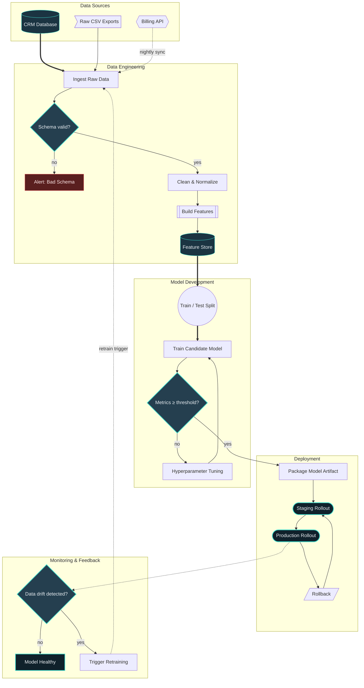

# Sample diagram

Reference template for this repo's Mermaid setup. It doubles as a smoke test:
[tools/shell_scripts/gen_diagrams.sh](../../../tools/shell_scripts/gen_diagrams.sh) pulls the first
fenced Mermaid code block out of every file under `docs/diagrams/sources/` and renders it to
`docs/diagrams/images/<same path>.png` using [theme.json](../theme.json). The extraction is
line-based and gets confused by a second fenced Mermaid block (or even the literal fence text
appearing elsewhere in the file), so keep exactly one such block per source file — copy this file
as a starting point for a new diagram rather than appending to this one.

The flowchart below is a mock data/ML pipeline ("Customer Churn Predictor") built to exercise the
Mermaid flowchart elements you'll reach for most often in this kind of project:

- **Node shapes** — process `[ ]`, terminal/stadium `( )`, decision `{ }`, database `[( )]`,
  subroutine `[[ ]]`, external system `{{ }}`, input `>]`, circle `(( ))`, parallelogram `[/ /]`
- **Edge styles** — solid `-->`, thick `==>`, dotted `-.->`, and both inline (`-- label -->`) and
  piped (`-->|label|`) edge labels
- **Structure** — subgraph grouping with per-subgraph direction, cross-subgraph edges, and a
  feedback loop back to an earlier stage
- **Styling** — `classDef` / `class` to color nodes by role, plus `%%` comments



## Rendering this file

```bash
REPO_ROOT=$(git rev-parse --show-toplevel)
"$REPO_ROOT/tools/shell_scripts/gen_diagrams.sh"
```

Output lands at `docs/diagrams/images/sample.png`, rendered with the repo's dark theme
(transparent background, teal accents from [theme.json](../theme.json)). Mindmap sources are the
one exception — the script auto-detects the mindmap keyword and renders those on a solid white
background instead, since mindmap's default styling doesn't hold up on the dark theme.

## Starting a new diagram type

This file only demonstrates the flowchart, since that's what the pipeline safely renders today.
For other diagram types (sequence, class, ER, state, gantt, mindmap, …), create a new file under
`docs/diagrams/sources/` with a single fenced Mermaid block, e.g.:

```text
docs/diagrams/sources/
├── sample.md               # this file — flowchart reference
├── api_sequence.md         # sequenceDiagram example
└── model_lifecycle.md      # stateDiagram-v2 example
```

Each file gets its own PNG under `docs/diagrams/images/`, mirroring the source path.
